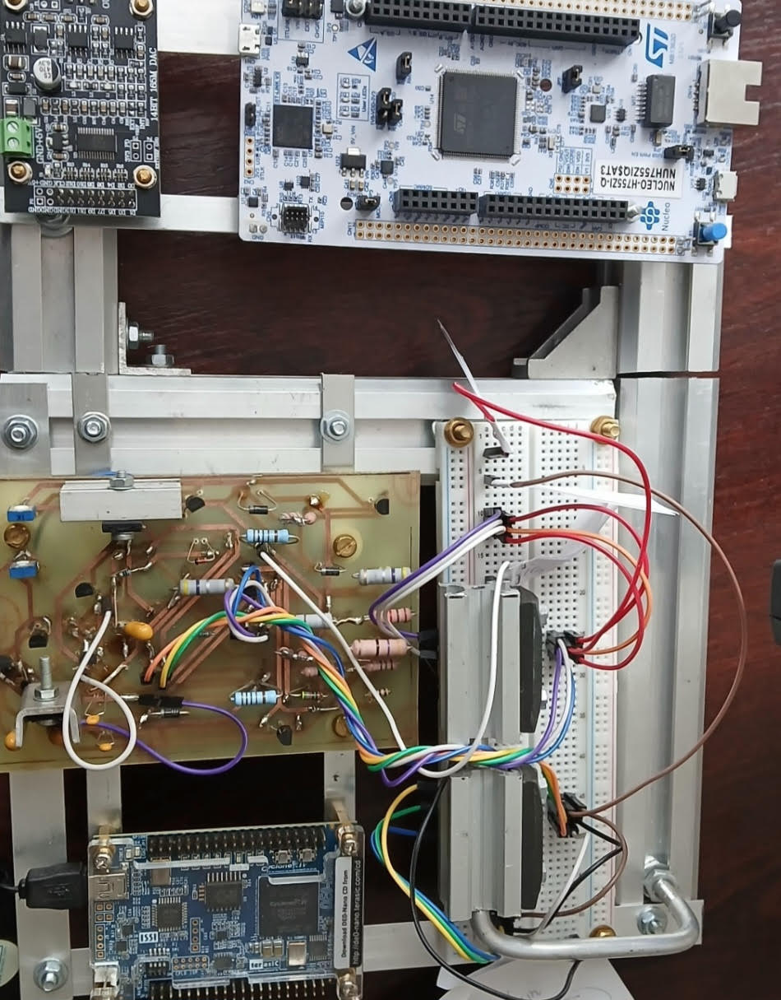

# Ultrasonic Vagus Nerve Stimulation System

## Description

Embedded system for non-invasive ultrasonic vagus nerve stimulation, integrating an Altera Cyclone IV (DE0-Nano) FPGA and an STM32 microcontroller with a high-speed DAC and a signal amplifier.
